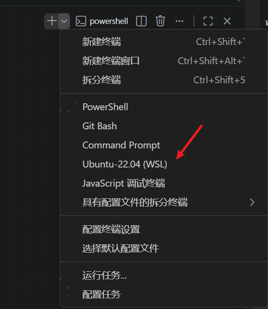

# 本地调试 STF

本文档介绍在本地环境（Windows + WSL2）下调试 STF 的完整流程。

---

## 1. 启动 WSL Ubuntu 系统

在 Windows 中启动 WSL Ubuntu 环境：

```powershell
wsl -d Ubuntu-22.04
```

也可以直接在 Qoder 等 IDE 中打开 Ubuntu 终端控制台，如下图所示：



---

## 2. 启动数据库 RethinkDB

STF 依赖 RethinkDB 作为存储组件。推荐使用 [`start.sh`](start.sh) 脚本一键启动，也可以手动启动容器。

### 方式一：使用 `start.sh` 自动启动（推荐）

[`start.sh`](start.sh) 脚本已内置 RethinkDB 容器检查和启动逻辑：

- 自动检测并清理旧的 `rethinkdb` 容器，避免冲突
- 映射端口 `8080`（管理界面）和 `28015`（客户端端口）
- 使用命名卷 `rethinkdb-data` 持久化数据
- 等待 RethinkDB 就绪后再继续后续步骤

直接跳到 [第 5 步](#5-一键启动脚本-startsh) 即可完整启动环境。

### 方式二：手动启动 RethinkDB 容器

```bash
docker run -d \
  --name rethinkdb \
  --restart unless-stopped \
  -p 8080:8080 \
  -p 28015:28015 \
  -v rethinkdb-data:/data \
  rethinkdb:2.4.2 \
  rethinkdb --bind all --cache-size 2048
```

---

## 3. 使用 ADB 连接终端设备

根据 ADB 服务的运行位置不同，主要有以下三种连接方式。

### 方式一：Ubuntu 系统内运行 ADB

**链路：** `STF → ADB（Ubuntu 系统内） → 本地设备`

**步骤：**

1. **Windows 侧先连接 USB**

   ```powershell
   adb devices
   ```
   确认设备已连接。

2. **开启设备的网络 ADB**

   ```powershell
   adb tcpip 5555
   ```

3. **查看设备 IP**

   ```powershell
   adb shell ip route
   ```
   或在手机的 `设置 → 关于手机 → 状态信息 → IP 地址` 中查看。

4. **在 WSL2 中连接设备**

   ```bash
   adb connect <设备IP>:5555
   adb devices
   ```

   示例：

   ```bash
   adb connect 192.168.1.105:5555
   ```

---

### 方式二：Windows 端运行 ADB Server（推荐，最简单）

**链路：** `STF → ADB（Windows 系统内） → 本地设备`

**步骤：**

1. **在 Windows PowerShell 中启动 ADB Server 并监听所有接口**

   ```powershell
   adb kill-server
   adb -a -P 5037 nodaemon server
   ```
   > `-a` 参数让 ADB Server 监听所有接口，允许 WSL 接入。

2. **另开一个 Windows PowerShell 连接设备**

   ```powershell
   adb connect 192.168.137.95:5555
   ```

3. **获取 WSL2 中可访问的 Windows 主机 IP**

   ```bash
   # 在 WSL 中执行
   cat /etc/resolv.conf | grep nameserver | awk '{print $2}'
   ```
   假设输出为 `172.x.x.1`。

4. **在 WSL 中启动 STF，指向 Windows ADB Server**

   ```bash
   npm run local -- --adb-host 172.x.x.1 --adb-port 5037 --allow-remote
   ```

> 这样 STF 的所有 ADB shell 连接走的是 WSL → Windows 的稳定本地通道，而 Windows ADB Server 自身维护到设备的 TCP 连接。

---

### 方式三：Docker 内运行 ADB 容器

**链路：** `STF → ADB（Docker 镜像内） → 本地设备`

**步骤：**

1. **启动 ADB 容器**

   ```bash
   docker run -d --name adb --restart unless-stopped -p 5037:5037 devicefarmer/adb:latest
   ```

2. **在容器内连接设备**

   ```bash
   docker exec adb adb connect 192.168.137.95:5555
   ```
   输出：设备连接成功。

3. **验证设备状态**

   ```bash
   docker exec adb adb devices
   ```
   确认只有目标设备，没有模拟器干扰。

4. **在 WSL 中启动 STF，连接 Docker 的 ADB 容器**

   端口已映射到 `localhost:5037`：

   ```bash
   npm run local -- --adb-host host.docker.internal --adb-port 5037 --allow-remote
   ```

---

## 4. STF 启动命令

根据上述 ADB 使用方式，STF 对应的启动命令如下：

- **方式一（对应 Ubuntu 内 ADB）：**

  ```bash
  npm run local -- --allow-remote
  ```

- **方式二（对应 Windows ADB Server）：**

  ```bash
  npm run local -- --adb-host 172.x.x.1 --adb-port 5037 --allow-remote
  ```

- **方式三（对应 Docker ADB 容器）：**

  ```bash
  npm run local -- --adb-host host.docker.internal --adb-port 5037 --allow-remote
  ```

> **提示：** 如果频繁进行本地调试，推荐直接使用 [`start.sh`](start.sh) 一键脚本，它会自动完成 RethinkDB 和 ADB 容器的启动、设备连接以及 STF 启动。详见 [第 5 步](#5-一键启动脚本-startsh)。

---

## 5. 一键启动脚本 `start.sh`

[`start.sh`](start.sh) 是为了简化本地开发调试而编写的集成脚本，一次执行即可完成：

1. 检查并选择可用的 Docker 命令（支持 WSL 原生 `docker` 和 Windows `docker.exe`）
2. 启动或复用 `rethinkdb` 容器（端口 `8080`、`28015`）
3. 启动或复用 `adb` 容器（端口 `5037`）
4. 自动连接指定设备
5. 注入常用的 STF 环境变量
6. 启动 STF 本地服务

### 使用方法

> **重要：** `start.sh` 是 bash 脚本，**必须在 WSL 终端中执行**，不能在 Windows CMD / PowerShell 中直接运行。原因详见 [FAQ Q2](#q2-在-windows-cmd-中运行-startsh-失败adb-容器启动异常)。

```bash
# 在 WSL Ubuntu 终端中执行
./start.sh [device_ip:port]
```

示例：

```bash
./start.sh 192.168.137.95:5555
```

脚本默认配置如下（可按需修改 [`start.sh`](start.sh) 顶部的配置区）：

| 配置项 | 默认值 | 说明 |
| --- | --- | --- |
| `DEVICE_ADDR` | `192.168.137.95:5555` | 默认连接的设备地址 |
| `ADB_HOST` | `host.docker.internal` | STF 连接 ADB Server 的宿主机地址 |
| `ADB_PORT` | `5037` | ADB Server 端口 |
| `ADB_IMAGE` | `devicefarmer/adb:latest` | ADB 容器镜像 |
| `PUBLIC_IP` | `10.18.208.172` | 用于公网访问的 IP（按需修改） |

### 环境变量

脚本启动前会自动注入以下环境变量，以优化本地调试体验：

```bash
STF_PROVIDER_SCREEN_JPEG_QUALITY=20
STF_PROVIDER_SCREEN_GRABBER=minicap-apk
STF_ADMIN_NAME=administrator@fakedomain.com
STF_ADMIN_EMAIL=administrator
STF_PROVIDER_HEARTBEAT_INTERVAL=10000
STF_PROVIDER_BOOT_COMPLETE_TIMEOUT=120000
TZ='America/Los_Angeles'
```

服务启动后，Web UI 默认访问地址为：http://localhost:7100

---

## 6. 使用 `docker-compose.dev.yaml` 开发调试

除了 `start.sh`，项目还提供了 [`docker-compose.dev.yaml`](docker-compose.dev.yaml) 用于容器化开发调试。它包含 `rethinkdb`、`adb`、`stf` 三个服务，并配置了端口映射、持久化卷和常用环境变量。

### 使用前准备

如果之前运行过 `start.sh` 创建了独立的 `adb` 容器，需要先停止并删除，避免 `5037` 端口冲突：

```bash
docker rm -f adb
```

### 启动服务

```bash
# 1. 启动全部服务（后台运行）
docker compose -f docker-compose.dev.yaml up -d

# 2. 连接设备
docker compose -f docker-compose.dev.yaml exec adb adb connect <设备IP:端口>

# 3. 查看 STF 日志
docker compose -f docker-compose.dev.yaml logs -f stf
```

### 停止服务

```bash
docker compose -f docker-compose.dev.yaml down
```

### 主要端口说明

| 端口 | 服务 | 说明 |
| --- | --- | --- |
| `8080` | rethinkdb | RethinkDB 管理界面 |
| `28015` | rethinkdb | RethinkDB 客户端端口 |
| `5037` | adb | ADB Server 端口 |
| `7100` | stf | STF Web UI |
| `7110` | stf | STF WebSocket |
| `7400-7500` | stf | 设备通信端口 |

> **注意：** 使用 `docker-compose.dev.yaml` 时，STF 运行在独立的 `stf` 容器内，需要提前构建好镜像（如 `stf-jhk`），或取消官方镜像 `devicefarmer/stf` 的注释直接使用。

---

## 7. 近期功能更新速览

当前分支（`dev_1.0.1`）在最近迭代中新增了以下功能，本地调试时可以直接体验和验证：

### 7.1 设备断开后重连

- 支持通过 ADB 重新连接已断开设备
- CLI 新增 `--adb-host` 和 `--adb-port` 选项，用于指定外部 ADB Server
- 设备列表中针对离线设备显示**重连按钮**，点击后调用后端接口重连
- 相关接口：`POST /devices/{serial}/reconnect`

### 7.2 截图按钮

- 远程控制面板新增**截图按钮**
- 点击后触发 `sendKeyEvent(301)` 事件，可在设备端实现截图行为
- 使用相机图标并显示“截图”文本提示

### 7.3 设备删除

- 设备列表详情中根据设备状态显示**删除按钮**
- 删除前弹出确认提示框，删除成功后移除对应设备行
- 删除失败时显示错误提示

### 7.4 设备占用

- 设备列表详情中针对可用设备显示**占用按钮**
- 点击后弹出占用弹窗，可输入占用时长并发送占用请求
- 支持确认、取消及键盘快捷键操作

### 7.5 遥控器控制

- 新增 `remote-control` 模块，为无触控设备提供远程控制能力
- 底部标签栏精简为只保留**遥控器**和**日志**，隐藏截图、自动化、高级、文件管理、信息等标签
- 控制面板模块引入中新增遥控器模块依赖
- 遥控器面板支持方向键、确认键等常用控制按钮

### 7.6 今日改动汇总（2026-09-26 · dev_1.2.0）

dev_1.2.0 分支本日改动（`f34ca985`、`5dd87bf3`、`72c0f341` 三次提交 + 未提交微调），均为前端 UI 层，需 `gulp`/webpack 重新构建后刷新验证。

**语音环境切换**（`res/app/control-panes/dashboard/navigation/`，`5dd87bf3`）

在已有语音发送面板基础上新增环境切换能力，替代 `tmp/debug_*语音.bat` 手动脚本：

- 读取 `areaurl`、`aicloudurl`、`digitalurl`、`taskmaster_test`、`test_url_llm` 五个 global settings 判定当前环境（全有=测试/橙、全空=正式/绿、部分=未知/灰）
- 一键测试↔正式切换，固定执行 `pm clear` + 重启语音服务（不重启配置不生效），执行前二次确认
- UI 打磨：「当前语音环境」「点击切换:」、勾选框对齐/冒号间距/长文案单行；刷新成功不再提示「已刷新」，仅切换成功时提示

**控制面板布局**（`control-panes-hotkeys-controller.js`、`control-panes.pug`、`dashboard.pug`、`remote-control/`、`device-control.pug`）

- 设备屏幕与控制栏的默认分隔比例最终定为 65:35（三分律）；本日多次调整，改变了此前左侧设备屏幕区偏小的布局
- 左右分隔条拖拽宽度按像素持久化到 `localStorage`（键 `stf.controlPane.remotePaneSize`），下次自动恢复；底部分隔不持久化，刷新即回默认
- 设备屏幕顶部工具栏新增「↺ 重置布局」，点击即时清除记忆并恢复默认（强制 west 面板重排，无需刷新）
- `dashboard.pug` 按高度重新配对组件（语音发送↔应用程序、上传APP↔设备拓展、Shell↔远程调试），消除右侧空余、左右更均衡
- 底部面板加高至 38% 并紧凑化遥控器样式，完整显示「主页/返回/菜单/识屏」按钮

**设备备注与远程面板**（`f34ca985`）

- 调整远程控制面板尺寸
- 新增设备备注（notes）展示样式

**全局HTTP代理设置**（2026-09-28 新增 · 2026-09-29 调整 · `res/app/control-panes/advanced/proxy/`）

- 位置：设备控制页（`/control/:serial`）顶部「高级(Advanced)」标签，面板名为「**全局HTTP代理设置**」（原名「设置代理」）。2026-09-29 重排：第一行为「高级输入 + 全局HTTP代理设置」左右并排，第二行为「维护 + 转发端口」，高面板与高面板、矮面板与矮面板配对以降低总高；同行面板通过 `advanced.css` 的 `.advanced-pair-row` flex 等高对齐（仅 ≥992px 生效）
- 两行输入框：第一行「代理地址」直接输入 `ip:端口`，**设置代理**、**关闭代理**按钮位于其输入框下方；第二行「Whistle Web访问地址」由用户手动输入，行标题右侧提供「**点击访问**」（新窗口打开，缺 scheme 时自动补 `http://`），输入框下方为「**保存地址**」按钮
- Whistle 地址持久化（2026-09-29）：点击「保存地址」后通过 `SettingsService` 按设备 serial 分别写入用户设置（socket → `dbapi.updateUserSettings` → RethinkDB，键 `whistleUrls` 对象），不做输入即存；进入面板时查询当前设备是否已保存过地址，已保存则回显到输入框（同设备仅回显一次，不覆盖用户编辑）
- 配套后端修复（2026-09-29）：上游 `dbapi.updateUserSettings`（`lib/db/api.js`）原为整列替换语义，单键增量会覆盖丢失其他用户设置，已改为 `r.row('settings').default({}).merge(changes)` 显式合并；该字段无需表结构变更，新增键为自由 JSON，上线/回滚均兼容
- 代理回显：切到「高级」时面板会重新实例化，此时执行 `adb shell settings get global http_proxy`；已设置则直接填入代理地址输入框（输出为 `null`/`:0` 视为未设置）
- 关闭代理回读校验（2026-09-29）：`clearProxy` 下发 `:0` 后立即回读 `settings get`，若仍残留旧地址则提示「清理指令已下发但代理仍为 xxx，请强停被测应用或断开重连网络后重试」（`settings put global http_proxy :0` 仅对新连接生效，存量长连接/应用缓存代理需重启应用或重连网络，一般无需重启电视）；确认弹窗统一用 `$window.confirm`
- 实现方式：复用当前设备的 `control.shell()`（前端直连，无后端 HTTP 接口），设置等价于 `adb shell settings put global http_proxy ip:端口`，关闭为 `:0`
- shell 输出为分片传输，需join `result.data` 得到完整结果（`lastData` 仅为最后一段）
- 涉及文件：`res/app/control-panes/advanced/proxy/`（新增模块）、`advanced.pug`、`index.js`

## 8. 常见问题（FAQ）

### Q1: STF 启动后设备 worker 反复崩溃，日志提示 `Failed more than 3 times in 10000ms`

**现象**

启动 STF 并连接网络 ADB 设备后，控制台循环出现类似如下错误：

```text
WRN/device:plugins:touch  [xxx.xxx.xxx.xxx:5555] Connection to minitouch ended unexpectedly
INF/device:plugins:touch  [xxx.xxx.xxx.xxx:5555] Launching touch service
INF/device:plugins:touch  [xxx.xxx.xxx.xxx:5555] minitouch says: "Unable to find a suitable touch device"
INF/device:plugins:touch  [xxx.xxx.xxx.xxx:5555] minitouch says: "using Android InputManager"
ERR/device:plugins:touch  [xxx.xxx.xxx.xxx:5555] Touch consumer had an error Error: Failed more than 3 times in 10000ms
FTL/util:lifecycle  [xxx.xxx.xxx.xxx:5555] Shutting down due to fatal error
```

**原因**

通常是**之前某次 STF 实例没有彻底退出**，形成了"僵尸"进程。该残留实例持续占用设备的 ADB 连接，并在设备端保持 `stf.agent` / `minitouch` / `minirev` 等 shell 进程。新启动的 STF 再次连接同一台设备时，会因为 `localabstract:minitouch` socket 被占用而启动失败，失败次数在 10 秒内累积到 3 次即触发 fatal，导致设备 worker 退出。

**验证**

在 ADB 容器中执行：

```bash
docker exec adb adb -s <设备IP>:5555 shell "ps -A | grep -E 'stf.agent|minitouch|minirev'"
```

如果看到相关进程，且手动 `pkill` 后进程又重新出现，即可确认存在残留 STF 实例在拉起这些进程。

**解决方案**

1. 优先尝试彻底清理设备端残留进程：
   ```bash
   docker exec adb adb -s <设备IP>:5555 shell "pkill -9 stf.agent; pkill -9 minitouch; pkill -9 minirev"
   ```

2. 检查并关闭所有可能运行 STF 的终端、IDE 运行任务、WSL 会话等，确保没有残留 node 进程。

3. 若清理后问题依旧，最直接的方案是**重启电脑**，以彻底清除所有残留的 STF 进程和 ADB 连接状态。

**预防**

- 停止 STF 时不要只关闭浏览器或终端窗口，应在启动终端按 `Ctrl+C` 等待所有子进程退出。
- 停止后可通过 `ps -A | grep -E 'stf.agent|minitouch|minirev'` 确认设备端进程已被清理。

### Q2: 在 Windows CMD 中运行 `start.sh` 失败，ADB 容器启动异常

**现象**

在 Windows CMD 中通过 Git Bash 或其他方式执行 `./start.sh`，`rethinkdb` 容器可能正常启动，但 `adb` 容器一直失败，后续设备连接和 STF 启动也随之失败。

**原因**

`start.sh` 是 bash 脚本，依赖 Linux 环境执行。在 Windows CMD 中运行存在以下问题：

1. **行尾符差异（CRLF vs LF）**：Windows 下 Git 检出的文件换行符为 `\r\n`（CRLF），bash 会将 `\r` 当作命令/变量的一部分，导致容器名、参数值等混入不可见字符，后续命令因找不到正确的名称而失败。这是最主要的原因。
2. **路径格式不兼容**：脚本中的路径拼接、变量替换均按 Linux 风格编写，Windows CMD 使用反斜杠路径（`C:\Users\...`），与脚本预期不符。

> 注：WSL 和 Windows CMD 中的 Docker 命令最终连接的是同一个 Docker Desktop 守护进程，Docker 操作本身没有差异，问题纯粹出在 bash 脚本的执行环境上。

**解决方案**

始终在 **WSL Ubuntu 终端** 中运行 `start.sh`，WSL 提供原生 Linux 环境，Docker 客户端、行尾符和路径格式均正确：

```bash
# 在 WSL 终端中执行（正确）
./start.sh 192.168.137.95:5555
```

## 9. 镜像构建与上线部署

### 9.1 本地构建 Docker 镜像

在项目根目录执行：

```bash
docker build -t stf:<版本号> .
```

示例：

```bash
docker build -t stf:3.7.8 .
```

构建过程会基于 [`Dockerfile`](Dockerfile) 完成以下操作：

- 安装 Node.js、构建工具及运行时依赖
- 执行 `npm install` 与 `npm pack`
- 将产物解压到 `/app` 目录
- 清理开发依赖与临时文件

#### 使用代理构建（网络受限时）

Docker 构建运行在 Hyper-V 虚拟机中，宿主机的 VPN 不会自动应用到构建容器内部。如果构建过程中 `apt-get` 出现 `502 Bad Gateway` 或 `Connection failed` 等网络错误，需要通过 `--build-arg` 将代理传入构建环境：

```powershell
docker build --build-arg http_proxy=http://host.docker.internal:<代理端口> --build-arg https_proxy=http://host.docker.internal:<代理端口> -t stf:<版本号> .
```

示例（Clash Verge，端口 7897）：

```powershell
docker build --build-arg http_proxy=http://host.docker.internal:7897 --build-arg https_proxy=http://host.docker.internal:7897 -t stf-jhk:1.2.0 .
```

> **前提条件：**
> - 代理软件（如 Clash Verge）需开启 **"Allow LAN"（允许局域网连接）**，否则 Docker VM 的请求会被拒绝
> - `host.docker.internal` 是 Docker Desktop 提供的特殊 DNS，指向宿主机，替代 `127.0.0.1`
> - 构建完成后控制台可能出现 `WARNING: current commit information was not captured by the build` 提示，这是因为 `.dockerignore` 排除了 `.git` 目录，Docker 无法读取 Git 提交信息，**不影响镜像功能**，可忽略

> 注意：构建耗时较长，请确保网络畅通且 Docker 有足够磁盘空间。

### 9.2 导出镜像为 tar 包

构建成功后，将镜像导出为 tar 文件，便于传输到无外网的服务器：

```bash
docker save -o stf-<版本号>.tar stf:<版本号>
```

示例：

```bash
docker save -o stf-3.7.8.tar stf:3.7.8
```

导出后可通过 `ls -lh` 查看 tar 包大小。

### 9.3 将 tar 包上传到服务器

根据服务器环境选择传输方式，例如 `scp`、`rsync` 或 FTP：

```bash
scp stf-3.7.8.tar user@your-server:/path/to/deploy/
```

### 9.4 服务器导入镜像

登录服务器，进入 tar 包所在目录，执行导入：

```bash
docker load -i stf-3.7.8.tar
```

导入成功后，可通过以下命令确认镜像存在：

```bash
docker images | grep stf
```

### 9.5 服务器运行 STF 容器

#### 方式一：使用 docker-compose（推荐）

参考项目已有的 [`docker-compose.yaml`](docker-compose.yaml)，将 `stf` 服务的镜像替换为刚刚导入的镜像：

```yaml
stf:
  container_name: stf
  image: stf:3.7.8   # 替换为实际版本号
  ports:
    - "7100:7100"
    - "7110:7110"
    - "7400-7500:7400-7500"
  environment:
    - TZ='America/Los_Angeles'
    - RETHINKDB_PORT_28015_TCP=tcp://rethinkdb:28015
    - STF_ADMIN_EMAIL=<YOUR_EMAIL>
    - STF_ADMIN_NAME=<YOUR_NAME>
  restart: unless-stopped
  command: >
    stf local
    --adb-host adb
    --public-ip YOUR_SERVER_IP
    --provider-min-port 7400
    --provider-max-port 7500
```

启动服务：

```bash
docker-compose up -d
```

#### 方式二：使用 docker run 手动启动

```bash
docker run -d \
  --name stf \
  --restart unless-stopped \
  -p 7100:7100 \
  -p 7110:7110 \
  -p 7400-7500:7400-7500 \
  -e TZ='America/Los_Angeles' \
  -e RETHINKDB_PORT_28015_TCP=tcp://<rethinkdb-host>:28015 \
  -e STF_ADMIN_EMAIL=<YOUR_EMAIL> \
  -e STF_ADMIN_NAME=<YOUR_NAME> \
  stf:3.7.8 \
  stf local \
    --adb-host <adb-host> \
    --public-ip <YOUR_SERVER_IP> \
    --provider-min-port 7400 \
    --provider-max-port 7500
```

### 9.6 验证部署

1. 查看容器状态：
   ```bash
   docker ps | grep stf
   ```

2. 查看启动日志：
   ```bash
   docker logs -f stf
   ```

3. 浏览器访问 `http://<YOUR_SERVER_IP>:7100`，确认 STF Web 界面正常。

4. 连接一台测试设备，确认设备列表可正常显示并能进入远程控制面板。
